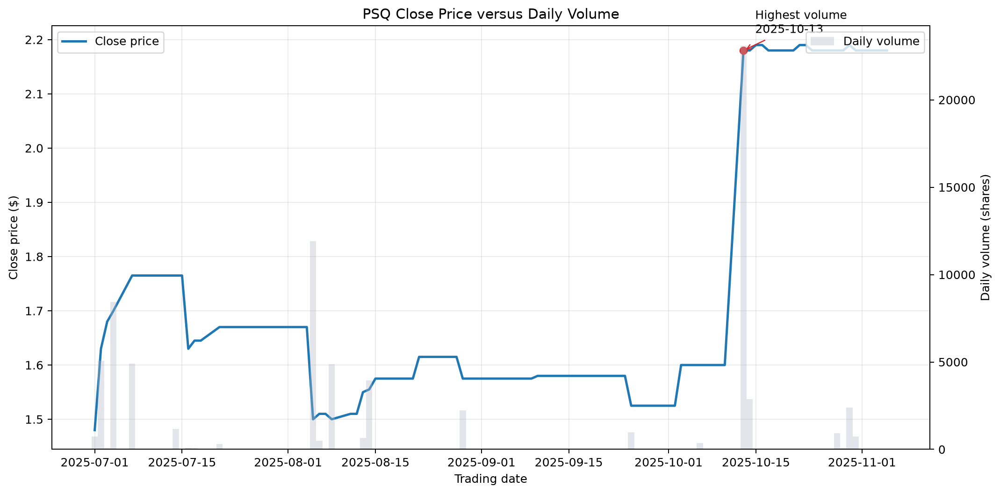
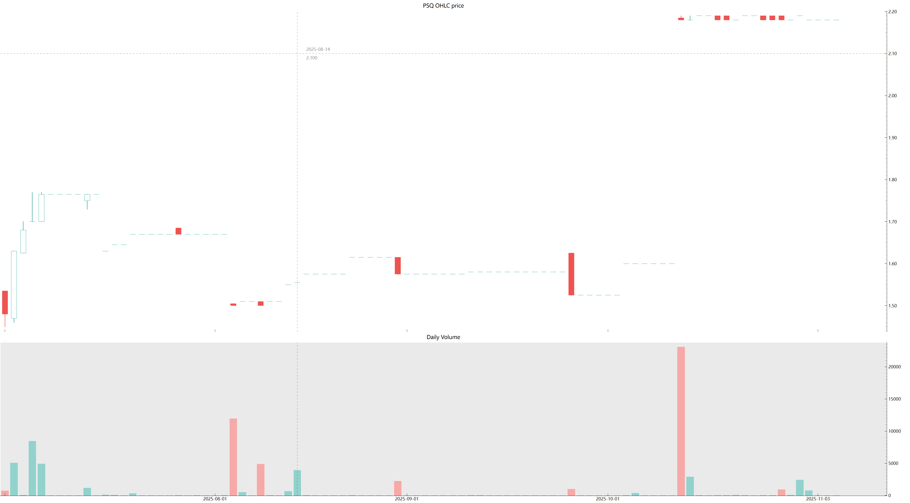
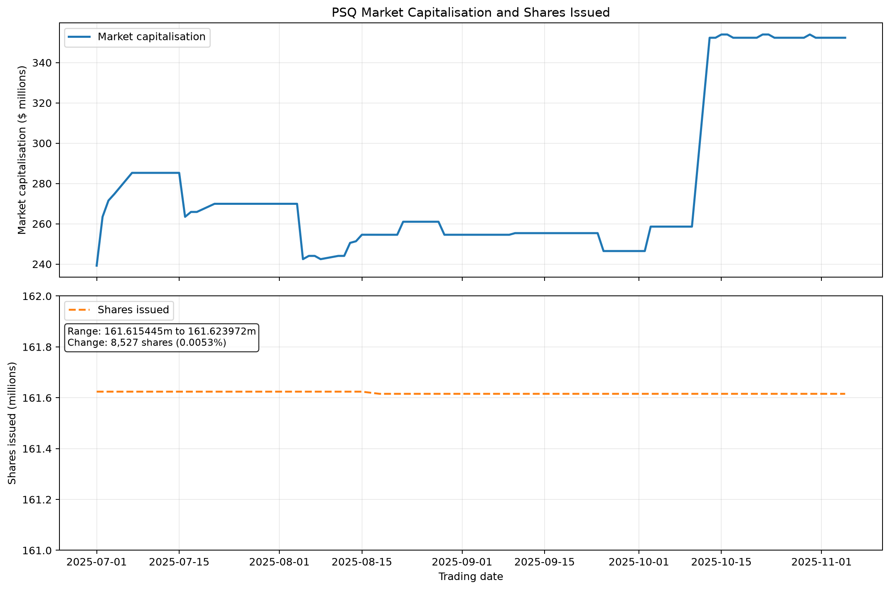
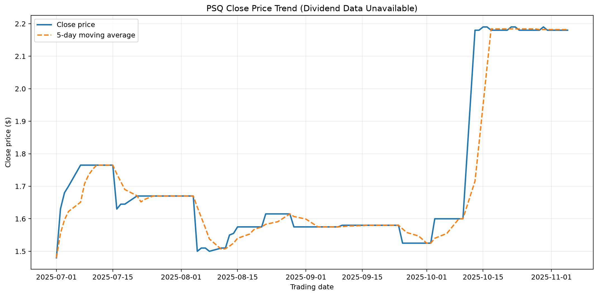
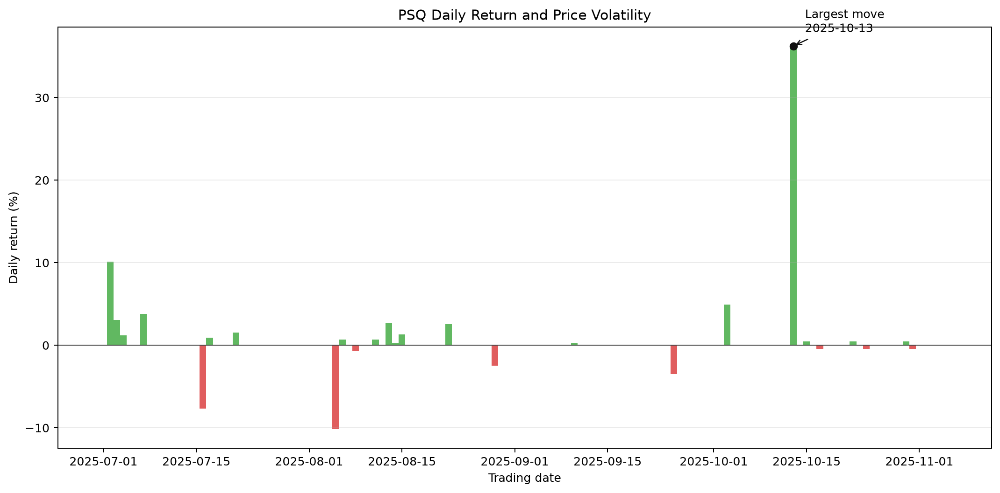
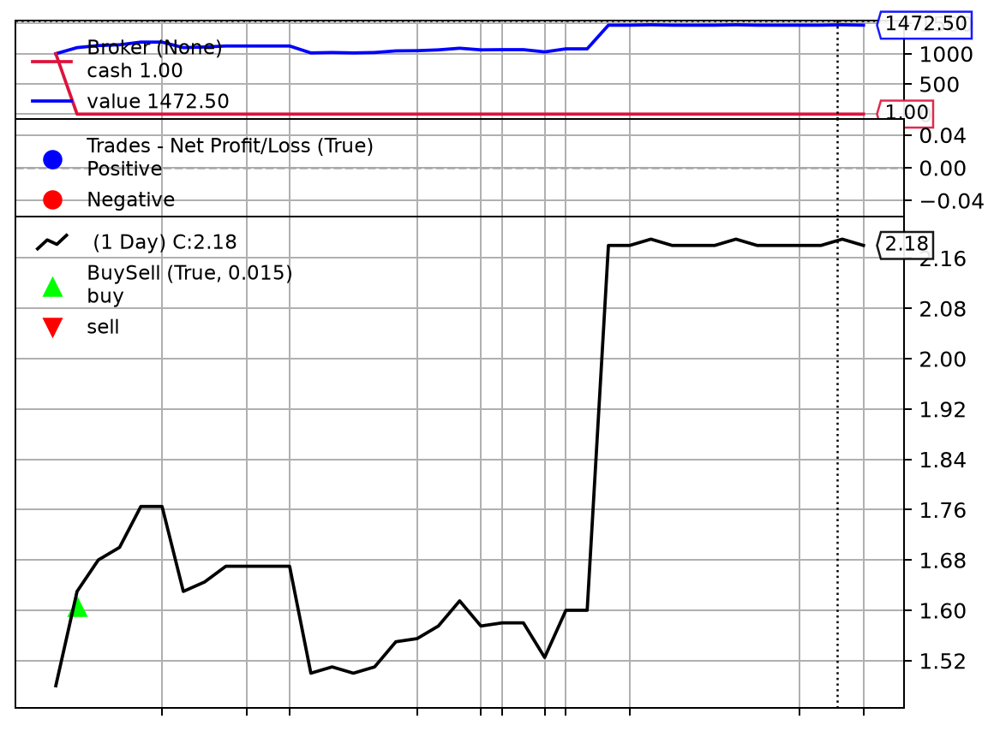
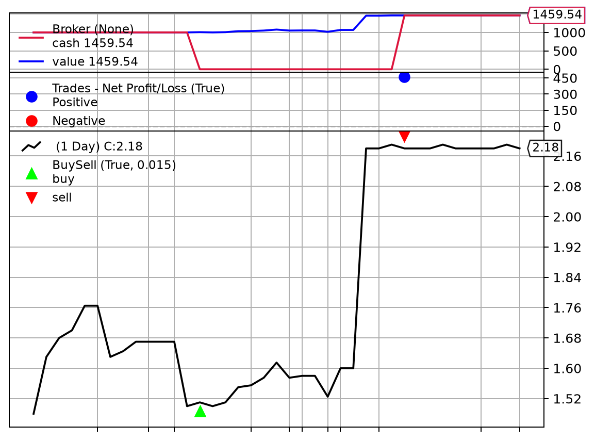
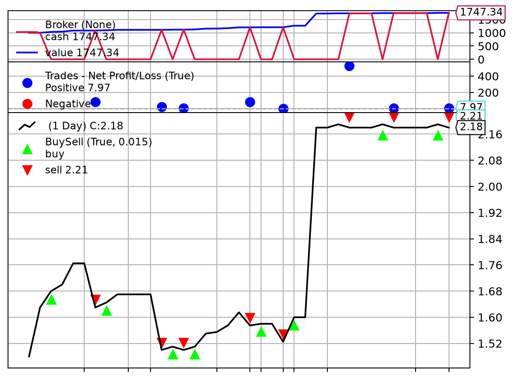

# Pacific Smiles Group Limited (ASX: PSQ)

## 32146 Data Visualisation Foundations: AT1 English Preview

## 1. Executive Summary

This report analyses the price, trading volume, shares on issue and portfolio performance of Pacific Smiles Group Limited (ASX: PSQ) during the 2025–2026 financial year. The planned data range was 1 July 2025 to 30 June 2026. However, PSQ was **acquired and delisted on 5 November 2025**, so the actual observable trading period only extends to early November 2025.

The charts show that PSQ's share price increased noticeably before the acquisition event and remained around A$2.18 near the delisting records. Theoretical backtests indicate that an initial A$1,000 investment could have generated a relatively high return between the retrospectively optimal entry and exit dates. However, these results rely on hindsight, and the stock had very low trading volume. They should therefore not be treated directly as realistic or executable investment advice.

**Key conclusion:** The main story of PSQ is not that of an ordinary stock that could be traded continuously, but a special case involving an acquisition, delisting and low liquidity. Regardless of the backtest results, it does not demonstrate practical tradability.

## 2. Data Collection and Preparation

### 2.1 Dataset

| Item | Description |
| --- | --- |
| Company | Pacific Smiles Group Limited |
| ASX code | PSQ |
| Data range | 2025-07-01 to 2026-06-30 (target period) |
| Actual available price records | 2025-07-01 to approximately 2025-11-05 |
| Main fields | Date, Open, High, Low, Close, Volume, Shares on Issue |
| Data source | Price history exported from DatAnalysis |
| Dividend data | No available dividend records for the current financial year |
| PE data | No usable PE field in the original data |

The original data contains records with zero volume and Open/High/Low prices equal to zero. These records were not simply deleted because they reflect suspended trading, no transactions or the post-delisting data state. To draw the OHLC chart, zero price values were replaced with the same day's Close in the display dataset. Volume was retained as zero and shown in the charts as an indication of data quality and liquidity.

### 2.2 Calculated Fields

This preview uses the following derived metrics:

- **Market capitalisation** = Close × Shares on Issue
- **Daily return** = Current-day Close / Previous trading day's Close − 1
- **Cumulative return** = Close / First Close in the period − 1
- **5-day moving average** = Average Close over the most recent five price records
- **Portfolio value:** initial capital of A$1,000, excluding fees and slippage

## 3. Exploratory Data Analysis (EDA)

### 3.1 Data Characteristics

The number of PSQ shares on issue remained broadly stable during the observation period. Therefore, changes in market capitalisation were driven mainly by changes in the closing price rather than changes in the number of shares. Trading volume was not always aligned with price movements, and the large number of zero-volume records indicates limited actual liquidity.

Dividend and PE data were unavailable, so a genuine cross-sectional analysis of dividend yield or price-to-earnings ratios could not be performed. This report does not replace missing dividend or PE values with zero; instead, the data limitations are stated explicitly in the relevant charts and conclusions.

### 3.2 Important Anomalies

1. Delisting- and acquisition-related records appear in early November 2025.
2. Volume is zero on multiple dates, so these dates should not be interpreted as normal market trading days.
3. The optimal buy and sell dates in the backtests were derived retrospectively from the complete period, creating clear look-ahead bias.
4. Actual trading volume was low, so the number of shares that could theoretically be purchased may not have been fully executable in the market.

## 4. Visualisation Analysis

### Figure 1: Closing Price and Daily Trading Volume

Figure 1 uses dual Y-axes to display the closing price and trading volume simultaneously. The price line shows the trend, while the bars show trading activity. Volume peaks help identify whether price changes were accompanied by higher levels of market participation.

The dual-axis format can easily lead to scale misinterpretation. Therefore, the price and volume axes are labelled with separate units. Dates with zero volume should not be interpreted as evidence that the price was unchanged or that the market accepted the displayed price.

### Figure 2: OHLC Price Movement

Figure 2 uses candlesticks and price movement to show the relationship between Open, High, Low and Close. This is more suitable than a closing-price line alone for observing the daily price range and price jumps.

### Figure 3: Market Capitalisation and Shares on Issue

Market capitalisation is determined jointly by the closing price and the number of shares on issue. Since the number of PSQ shares on issue changed very little, the main fluctuations in the chart can be attributed to changes in the share price. The chart uses two vertically arranged panels to avoid misinterpretation caused by placing market capitalisation in Australian dollars and the number of shares on the same scale.

### Figure 4: Closing-Price Trend and Dividend Data Alternative

No usable dividend records were available for the financial year. Therefore, this figure uses the closing price and a moving average to show the price trend. The 5-day moving average reduces visual noise from daily fluctuations and helps reveal the short-term direction.

### Figure 5: Daily Returns and Price Volatility

Figure 5 converts daily price changes into percentage returns and uses different colours to distinguish increases and decreases. The largest absolute movement is marked separately to help identify abnormal trading days and potential event effects.

### Figure 6: A$1,000 Buy-and-Hold Portfolio

This strategy assumes that an investor purchases PSQ with A$1,000 and holds it during the observation period. The backtest excludes fees, slippage and taxes. Changes in portfolio value reflect the direct effect of price changes on the investment.

Because PSQ was delisted during the financial year, the ending value in the chart should be understood as a settlement or valuation result based on the available price records, rather than as a continuously held portfolio that could be maintained indefinitely.

### Figure 7: Theoretical Maximum Profit from a Single Trade

The retrospectively optimal single trade identified by the backtest was:

| Item | Result |
| --- | ---: |
| Buy date | 2025-08-06 |
| Buy price | A$1.500 |
| Sell date | 2025-10-17 |
| Sell price | A$2.180 |
| Shares purchased | 666 |
| Theoretical profit | A$459.54 |
| Theoretical return | 45.95% |

This result shows that the observed price range contained substantial upside potential. However, it was found by searching the complete dataset retrospectively, and an investor would not have known the future optimal selling point on the purchase date. The figure should therefore be treated as a scenario analysis rather than an executable trading signal.

### Figure 8: Theoretical Optimal Sequence of Multiple Trades

The multiple-trade backtest repeatedly uses the available capital across several purchases and sales. The existing trade ledger shows a theoretical sequence of eight completed trades, with a final book value of approximately A$1,747.34.

This result is affected by the following assumptions:

- Retrospectively visible price lows and highs were used;
- Commissions, bid–ask spreads and slippage were excluded;
- Every trade was assumed to be executable at the recorded price;
- The number of shares available for purchase was not limited by trading volume;
- Real-world constraints related to delisting, suspension and unfilled orders were ignored.

Therefore, the multiple-trade chart is mainly intended to show how the price path affects portfolio value. It should not be interpreted as a promise of a realistic trading strategy.

## 5. Visualisation Methods and Design Choices

This preview uses the following visualisation methods:

| Method | Used in | Purpose |
| --- | --- | --- |
| Dual-Y-axis line and bar chart | Figure 1 | Compare price trends with volume activity |
| Candlestick / OHLC chart | Figure 2 | Show daily price ranges and direction |
| Vertically faceted line charts | Figure 3 | Display market capitalisation and share count separately |
| Moving average | Figure 4 | Reduce short-term noise and emphasise the trend |
| Positive/negative colour-coded bars | Figure 5 | Identify increases, decreases and extreme returns |
| Portfolio-value line chart | Figures 6–8 | Show how capital changes over time |
| Annotations and highlights | Figures 1, 5 and 7 | Help readers locate key dates |

The main design principle was to make each chart answer a specific question rather than simply display data. Price, volume, corporate capital structure and portfolio results were handled separately to avoid combining different units on a single axis.

## 6. Discussion from an Investor's Perspective

From a price-trend perspective, PSQ experienced substantial price changes before the acquisition and delisting. For investors, the most important risk was not simply price volatility, but the disappearance of continued trading opportunities after the status of the stock changed.

From a liquidity perspective, zero-volume records and low actual trading volume limit the practical meaning of the backtest results. The fact that 666 or 797 shares could theoretically be purchased does not mean that enough sell or buy orders were available in the market. If an order was large relative to the day's trading volume, the actual execution price could have differed significantly from the historical Close.

Therefore, potential investors should not assess the strategy solely on the returns shown in Figures 7 or 8. They should also consider:

- Whether the stock is still listed and tradable;
- Whether the day's trading volume and bid–ask spread support order execution;
- Whether acquisition, suspension or delisting events have changed the investment rationale;
- Whether the backtest uses future information;
- Whether actual trading costs would eliminate the theoretical profit.

## 7. Conclusion

This visualisation analysis found that the most informative features of the PSQ dataset were the acquisition and delisting event, rapid price changes and low liquidity. The eight figures demonstrate these features from the perspectives of price, volume, OHLC data, market capitalisation, shares on issue, returns and portfolio backtesting.

The buy-and-hold, single-trade and multiple-trade results can all be used as historical scenario illustrations, but they do not directly constitute investment advice. In particular, the single- and multiple-trade results depend on retrospectively optimal choices and exclude commissions, slippage, volume constraints and delisting risk.
